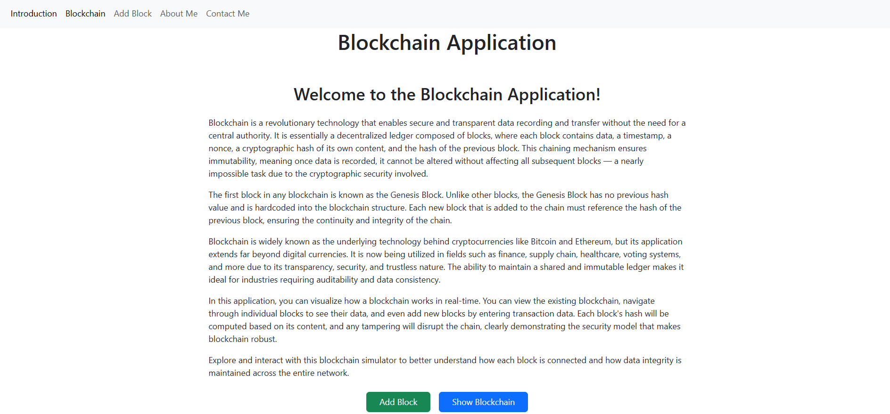
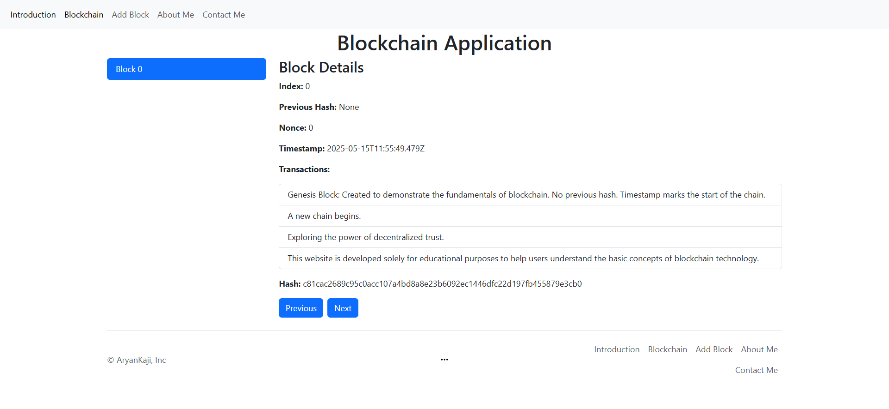
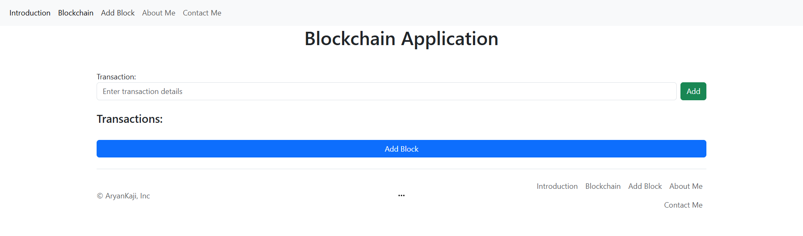
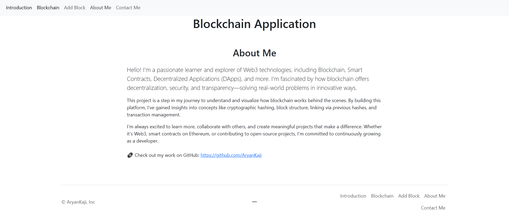
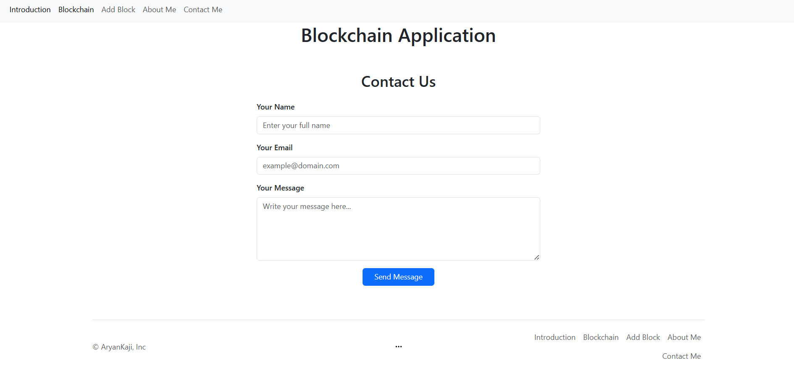
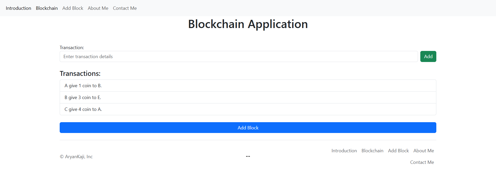
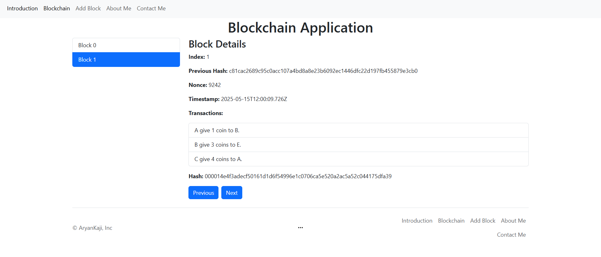

## `Blockchain Visualizer`
A web-based simulation of how a blockchain works, built using `HTML`, `AngularJS`, `Bootstrap`, and `CryptoJS`. This project allows users to understand blockchain concepts like blocks, transactions, hashes, and chain linkage through a responsive and interactive interface.

---

## `Features`
- View and interact with blocks in a blockchain
- Add new blocks with transaction data
- Hash blocks using `CryptoJS.SHA256`
- Genesis block initialization
- Navigate between blocks
- Fully responsive layout `(mobile + desktop)`

---

## `Technologies Used`
- HTML5
- AngularJS 1.x
- Bootstrap 4/5
- CryptoJS (SHA-256 hashing)
- Optional CSS media queries for enhanced responsiveness

---

## `Folder Structure`
```bash
blockchain-app/
├── index.html
├── app/
│   ├── app.module.js
│   ├── app.routes.js
│   ├── controllers/
│   │   ├── introController.js
│   │   ├── blockchainController.js
│   │   └── addBlockController.js
│   ├── services/
│   │   └── blockchainService.js
│   ├── views/
│   │   ├── intro.html
│   │   ├── blockchain.html
│   │   └── addBlock.html
├── assets/
│   ├── css/
│   │   ├── styles.css
│   │   └── bootstrap.min.css
│   ├── img/
│   │   └── Images
│   ├── js/
│   │   ├── crypto-js.min.js
│   │   ├── bootstrap.min.js
│   │   ├── angular.min.js
│   │   ├── angular-route.min.js
│   │   └── bootstrap.bundle.min.js
README.MD
```

---

## `How It Works`
- The Genesis Block is created with a default message and no previous hash.
- Users can enter transactions and add blocks to the chain.
- Each block includes:
  - Index
  - Timestamp
  - Nonce
  - Previous Hash
  - List of Transactions
  - Its own calculated Hash using `CryptoJS.SHA256`.
- The blockchain integrity is maintained by linking each block to the hash of the previous one.

---

## `Screenshots`







---

## `Screenshot Output`




---
